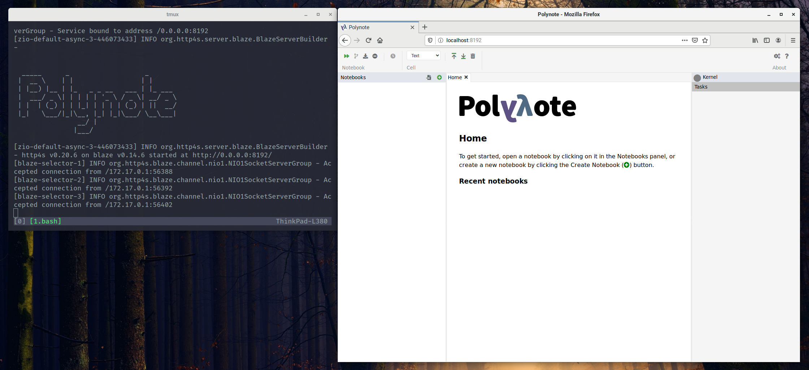

# Igloo

> An unofficial Docker version of Polynote

## Introduction

[Polynote](https://polynote.org) is an open source [Jupyter](https://jupyter.org/) alternative created by [Netflix](https://www.netflix.com) which supports polyglot (multiple programming languages) cells. Igloo is a Docker version of Polynote which simplifies setup and deployment.



## Key Features

Polynotes key features include **interactive auto-complete**, **error highlighting**, **rich text editing** and **LaTeX equations**. Currently only the [Scala](https://www.scala-lang.org/) and [Python](https://www.python.org/) programming languages are supported. Polynote also includes [Apache Spark](https://spark.apache.org/) support from both Python and Scala, see the [Polynote Docs](https://polynote.org/docs/02-basic-usage.html#using-spark-with-polynote) for more information.

## Getting Started

Before you proceed with usage examples, please ensure you have [Docker](https://docker.com) installed on your system.

### Usage

Clone this repo onto your system and build a local docker image.

```bash
git clone https://github.com/karlbateman/igloo ~/igloo \
  && cd ~/igloo \
  && docker build . --tag=karlbateman/igloo \
  ;
```

```bash
docker run --rm --tty --interactive \
  --publish=127.0.0.1:8192:8192 \
  --name=igloo \
  karlbateman/igloo \
  ;
```

For mounting a persisted volume, please use the following command.

```bash
docker run --rm --tty --interactive \
  --publish=127.0.0.1:8192:8192 \
  --name=igloo \
  --volume=~/.data/polynotes:/usr/src/app/polynote/notebooks \
  karlbateman/igloo \
  ;
```

Once the Igloo image has been built and the container launched you should be able to visit <http://localhost:8192> in your web browser.

## License

[BSD](LICENSE) © [@karlbateman](https://github.com/karlbateman)
